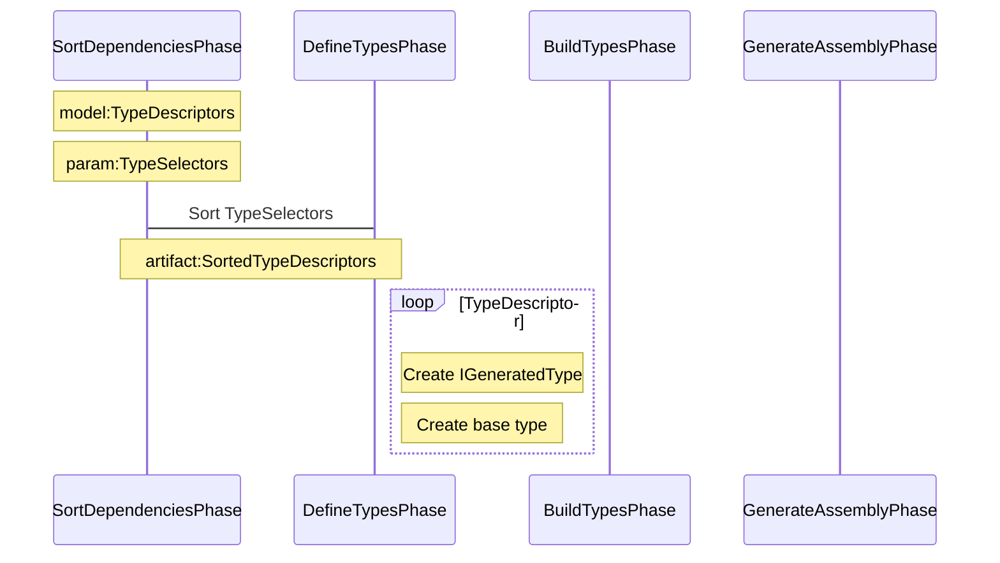

```mermaid
sequenceDiagram
    participant SortDependenciesPhase
    participant DefineTypesPhase
    participant BuildTypesPhase
    participant GenerateAssemblyPhase
    note over SortDependenciesPhase: model:TypeDescriptors
    note over SortDependenciesPhase: param:TypeSelectors
    SortDependenciesPhase->DefineTypesPhase: Sort TypeSelectors
    note over SortDependenciesPhase,DefineTypesPhase: artifact:SortedTypeDescriptors
    loop TypeDescriptor
        note right of DefineTypesPhase: Create IGeneratedType
        note right of DefineTypesPhase: Create base type
    end
```
